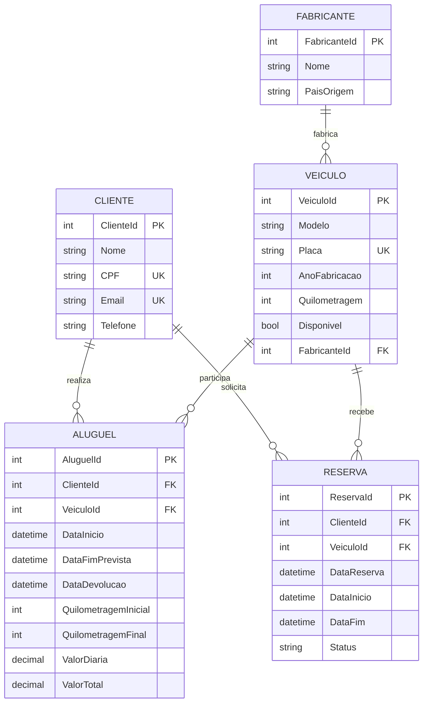

# Modelo conceitual - Locadora de Veiculos Erick

O sistema possui cinco entidades. `Reserva` e a entidade individual escolhida para este projeto.

## Relacionamentos

- Um fabricante pode possuir varios veiculos; todo veiculo pertence a um fabricante.
- Um cliente pode realizar varios alugueis; todo aluguel pertence a um cliente.
- Um veiculo pode participar de varios alugueis em periodos diferentes; todo aluguel pertence a um veiculo.
- Um cliente pode fazer varias reservas; toda reserva pertence a um cliente.
- Um veiculo pode receber varias reservas em periodos diferentes; toda reserva pertence a um veiculo.

## Restricoes de integridade

- As cinco entidades possuem chave primaria explicita.
- `FabricanteId`, `ClienteId` e `VeiculoId` sao chaves estrangeiras explicitas.
- Placa, CPF e e-mail sao unicos.
- Campos essenciais utilizam `Required` e limites de tamanho.
- Exclusoes relacionadas usam comportamento restrito para preservar os registros de alugueis e reservas.
